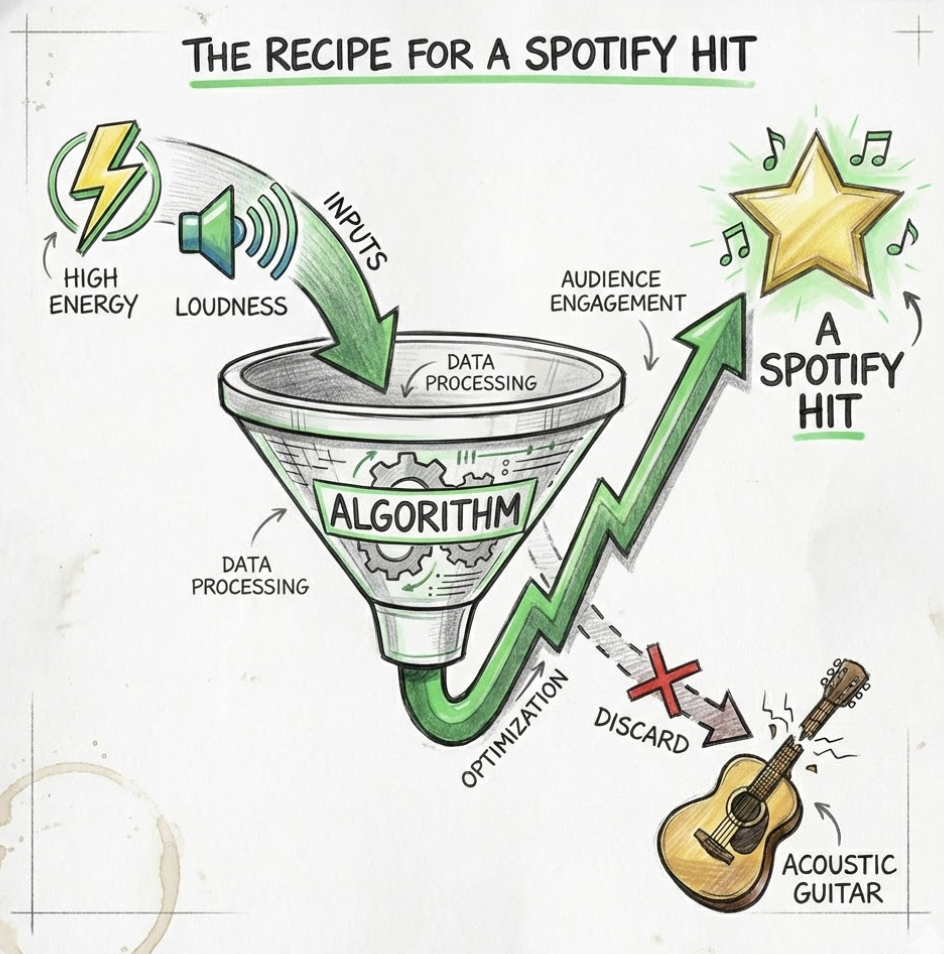

# 🎵 Spotify Hit Predictor: The "From Here" Project

> **Quando il Math Rock incontra la Data Science.**

## 📌 Intro
Tutti vogliono scrivere una hit. Io volevo solo capire **perché** alcune canzoni diventano hit e altre finiscono nel dimenticatoio digitale.
Per il lancio del mio brano **"from here"**, ho deciso di non affidarmi al caso. Ho preso un dataset di quasi 600.000 canzoni e ho addestrato una serie di modelli di Machine Learning per predire la **Popolarità** di un brano basandomi sulle sue caratteristiche audio (danceability, energy, loudness, ecc.).

## 📂 Il Dataset
- **Fonte:** Spotify Tracks DB
- **Dimensione:** ~586.000 righe, 20 colonne
- **Features:** Include metriche tecniche come `acousticness`, `danceability`, `energy`, `instrumentalness`, `loudness`, `speechiness`, `tempo` e `valence`.

## 🛠 Tech Stack
Il progetto è stato sviluppato interamente in Python all'interno di un Jupyter Notebook.
* **Data Manipulation:** `Pandas`, `Numpy`
* **Visualization:** `Seaborn`, `Matplotlib` (perché anche l'occhio vuole la sua parte)
* **Machine Learning:** `Scikit-learn`
* **Persistenza:** `Joblib`

## ⚙️ Il Processo (o "Come ho torturato la mia CPU")

### 1. Preprocessing & Scaling
Ho pulito i dati e testato diverse tecniche di scaling (`StandardScaler`, `MinMaxScaler`) per nutrire i modelli nel modo migliore. Per questioni di "poca potenza computazionale" (leggi: il mio laptop stava decollando ✈️), ho lavorato inizialmente su un sample di 50k righe.

### 2. Model Selection: La Battle Royale
Ho messo alla prova 7 algoritmi diversi per vedere chi ne usciva vivo:
- Linear Regression
- Lasso & Ridge
- Decision Tree
- **Random Forest** 🌲
- K-Neighbors
- Gradient Boosting

### 3. And the winner is... 🏆
**RandomForestRegressor**!
Si è dimostrato il modello più robusto, con il miglior bilanciamento tra bias e variance (R² score più alto sul test set) e un ottimo controllo dell'overfitting rispetto ai Decision Tree puri.

## 📊 Key Findings
L'analisi dell'importanza delle feature ha confermato quello che molti produttori sospettano:
* L'algoritmo ama l'**Energia** e il **Volume** (`Loudness`).
* Gli elementi acustici (`Acousticness`) tendono ad avere una correlazione inversa con la popolarità di massa.

## 💾 Output
Il modello vincente è stato salvato in `modello_spotify_randomforest.pkl`.
Ora posso (TEORICAMENTE) inserire i parametri di qualsiasi mia futura canzone e chiedere all'oracolo digitale se sarà un flop o una top 50.

## 🎧 About the Music
Tutto questo studio è stato fatto per **"from here"**, il mio brano Math Rock.
Ho usato i dati per comporre? No.
Ho usato i dati per capire come sopravvivere nella giungla dello streaming? Esatto.

---
**"Sono stanco capo 🫠"** - Cit. dal Notebook